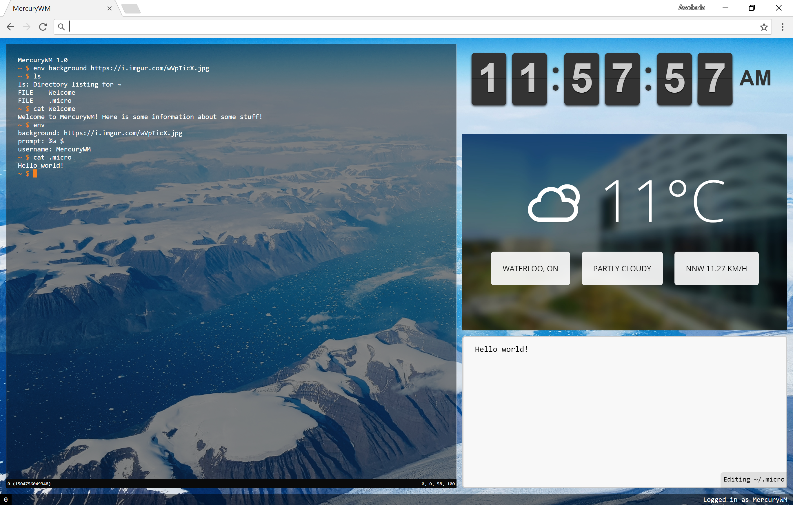

# MercuryWM 
MercuryWM is a Chrome extension that transforms your new tab page into a multi-windowed terminal environment.

## Build
- `git clone https://github.com/wheel-org/mercurywm.git`
- `npm install`
- `npm run dev`
  - This will also make webpack to watch for changes and rebuild on save

To build a production version, run `npm run prod`.

MercuryWM can also be built for web, instead of as an extension. To do this,
run `npm run web-dev` or `npm run web-prod`, and serve the `build` directory.

MercuryWM also uses Flow for static type checking. To use Flow, run `npm install -g flow-bin`, then either run `flow` in the root of MercuryWM, or use an editor plugin.

To run the extension, open `chrome://extensions` and enable `Developer mode`. Then click `Load unpacked extension` and navigate to the `build` directory. Your new-tab page will now be replaced with MercuryWM.

## Getting Started
- Click into the terminal window and run `setup`. This is a prebuilt setup script that will install `man` and `mmm`, the help files and the package manager. With these two programs, you can install other programs.

- Check out the wiki for more info about the system: https://github.com/wheel-org/mercurywm/wiki

